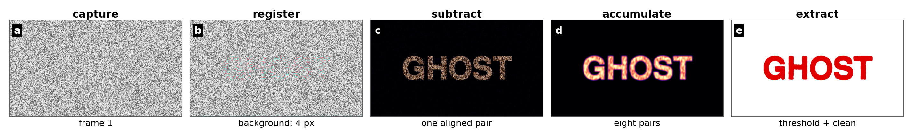
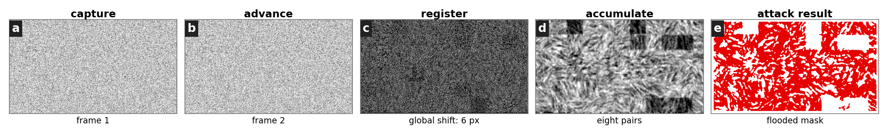

# Ghost Font bypass and hardening

| Before | After |
|:---:|:---:|
|  |  |

I built this after discovering a way to bypass the protection mechanism by identifying, aligning and removing the moving black elements. The attack uses nine frames, a small vertical-shift search, frame subtraction, thresholding and connected component analysis. It does not use machine learning.


## Browser version

Open the Ghost Font page https://www.mixfont.com/ghost-font, open the developer console, paste `code/ghost_font_browser_decoder.js` and press Enter. The script captures nine frames from the visible canvas and opens the recovered mask in an overlay.

Browser origin rules still apply. If the canvas cannot be read/download or record the animation and use the Python decoder.


## Setup

Python 3.12 and a system `ffmpeg` executable are required.

```bash
python -m pip install -r requirements.txt
```

## Attack


```bash
python code/vulnerable_ghost_font_demo.py \
  --output attack/ghost-vulnerable.mp4 \
  --report attack/ghost-attack.json \
  --artifacts attack/artifacts

python code/recover_ghost_font.py \
  attack/ghost-vulnerable.mp4 \
  --output attack/recovered-red.png \
  --classical-ocr \
  --ocr-output attack/recovered.txt
```


The measured mask overlap is `0.9077` IoU. The template readout is `GHOST`.

## Defense

```bash
python code/hardened_ghost_font_demo.py \
  --output defense/ghost-hardened.mp4 \
  --report defense/ghost-defense.json \
  --artifacts defense/artifacts
```

The same attack reaches `0.0761` IoU and returns `W4 WZWJ W`. This result is limited to the global vertical-registration attack implemented here.



## Figures

```bash
python code/build_attack_figure.py --results attack --output figures
python code/build_defense_figure.py --results defense --output figures
```

Both figures are built from the videos and decoder outputs in this repository.

